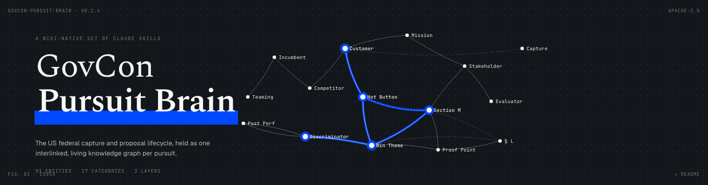
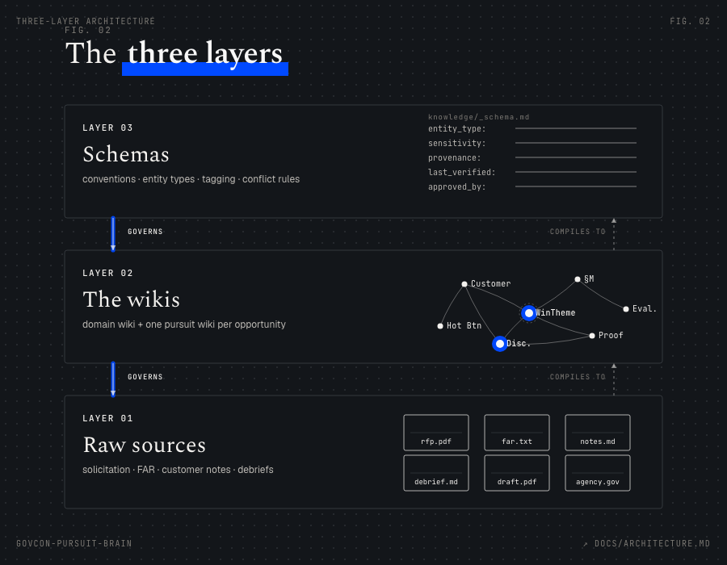

<p align="center"></p>

# GovCon Pursuit Brain

A wiki-native set of [Claude Skills](https://platform.claude.com/docs/en/agents-and-tools/agent-skills/overview)
for the US Federal capture and proposal lifecycle. This package is the
public GovCon pursuit method layer: domain knowledge, schemas, conventions,
playbooks, validators, and pursuit workflows. It teaches the method. It is
not a company brain. The company-specific signal (customer relationships,
past performance, pricing posture, debrief lessons, team capacity) is
private and pairs with this package; see
[docs/customize-for-your-company.md](docs/customize-for-your-company.md).

Same lifecycle, same domain rigor, same guardrails as the sibling package
`federal-proposal-skills`, with a different architecture underneath.

> **Status: v0.2.4.** The three-layer architecture, the conventions, the
> per-pursuit schema, and two proof skills (`qualifying-opportunities`,
> `analyzing-competitors`) are complete. The domain wiki is a
> comprehensive, Obsidian-compatible vault of 93 sourced entity pages
> across 17 categories of federal acquisition (FAR, SBA, NIST, OMB, CMMC,
> FedRAMP, vehicles, source selection, capture, proposal craft, and
> more). The trust layer is enforced: every page carries `provenance`,
> `last_verified`, and `next_review_due` fields; `scripts/validate_vault.py`
> and `scripts/freshness_audit.py` check the vault; `knowledge/_source-policy.md`
> documents the authority ladder. `playbooks/` carries role-specific guides
> (capture manager, proposal manager, SME data call), and
> `docs/customize-for-your-company.md` plus `schema/company-context.template.md`
> document how to pair the public method with private company context. A
> synthetic public-only worked pursuit lives at
> [examples/syn-2026-r-0001/](examples/syn-2026-r-0001/). Open `knowledge/`,
> `playbooks/`, or the example directly in Obsidian to navigate. The
> remaining lifecycle skills are planned. See [CHANGELOG.md](CHANGELOG.md).

## The work, in universal terms: Plan, Create, Iterate

The package speaks goals first, then maps to GovCon vocabulary. Whatever
your shop calls a step ("Black Hat," "competitor analysis," "market intel"),
the same canonical job underneath does the same work.

| Phase | Goal | Canonical jobs |
|---|---|---|
| Plan | Decide whether and how to pursue, and shape the win. | opportunity qualification, customer and mission understanding, relationship and influence mapping, competitive intelligence, incumbent-vs-challenger strategy, teaming, past-performance fit, solution shaping, price-to-win, win strategy, capture planning. |
| Create | Turn the pursuit position into a compliant, compelling response. | solicitation intake, compliance tracing (L/M/C cross-walk), Q&A drafting, amendment impact, annotated outline, storyboarding, SME data calls, technical/management/PP/cost-volume drafting, claims and proof points, graphics, submission-package assembly. |
| Iterate | Test, fix, approve, submit, and learn. | solution review (Blue), early-draft review (Pink), cost/pricing review (Green), evaluator-perspective review (Red), executive readiness (Gold), production review (White Glove), review recovery, submission compliance check, debrief analysis, protest decision support, lessons learned. |

The full table, with every canonical job, its aliases, user goal, primary
outputs, and owning skills, lives in
[docs/lifecycle-taxonomy.md](docs/lifecycle-taxonomy.md). Skills carry
`canonical_job:`, `phase:`, and `common_names:` in their frontmatter so a
search for "Green Team," "pricing review," or "cost realism check" all
resolve to the same place.

## Two packages, one soul

This is one of two sibling packages for the same job. `federal-proposal-skills`
is an artifact pipeline: each skill produces a flat, numbered artifact, and
artifacts hand down a chain. `govcon-pursuit-brain` (this package) is a
knowledge wiki: the skills compile and maintain one interlinked, living
knowledge graph per pursuit, and render the proposal artifacts as views over
that graph.

Both cover the same lifecycle from bid/no-bid through debrief, with the same
defensible core: bid/no-bid discipline, federal capture planning, Black Hat
competitive assessment, price-to-win, Section L/M/C traceability,
storyboarding, evaluator-perspective Red Team scoring, past-performance
relevancy, orals as a scored event, and the debrief loop. Both refuse to
fabricate evidence, both respect procurement integrity, both treat Section L
as governing.

They differ in how knowledge is held. They are launched together on purpose:
the artifact pipeline is simpler and more predictable; the pursuit brain
compounds knowledge and reasons across it. Real users will tell us which
they want.

## The idea: a pursuit is a knowledge graph

A federal pursuit is full of entities: the customer, each stakeholder, each
competitor, each hot button, each win theme, each discriminator, each
requirement, each proposal section, each risk, each teammate. In a
flat-artifact package those entities are buried inside documents. A
competitor lives as a row in one file and a paragraph in another, and
nothing connects them.

This package makes each entity a first-class, interlinked page. A win theme
links to the discriminator it rests on, the hot button it serves, the
Section M factor it is scored under, the proof points behind it, and every
section that threads it. Ask "what happens if this discriminator does not
hold up?" and the answer is a graph traversal, not a re-read of thirty
files.

This is Andrej Karpathy's LLM Wiki pattern applied to federal proposals:
knowledge is compiled into a maintained, interlinked wiki, not rediscovered
from raw documents on every query. See [docs/architecture.md](docs/architecture.md).

## The three layers

<p align="center"></p>

| Layer | What it is | Where it lives |
|---|---|---|
| 1. Raw sources | The solicitation, the FAR, customer notes, debriefs, competitor public data | a pursuit's `sources/` |
| 2. The wikis | The domain wiki (static federal-acquisition knowledge) and the pursuit wiki (one living entity graph per pursuit) | `knowledge/` and `pursuits/<id>/` |
| 3. The schemas | The config docs that define each wiki's conventions, entity types, tagging, and conflict rules | `knowledge/_schema.md` and a pursuit's `pursuit.md` |

The skills are the engine: they read Layer 1, maintain Layer 2 against the
rules in Layer 3, and render the human-facing proposal artifacts as views.

## What the wiki substrate buys you

Because every entity page carries metadata tags, several things that would
otherwise be separate features fall out of the architecture:

- Provenance and audit trail. Every page records its `source`, `confidence`, and the skill run that last touched it.
- Sensitivity control. Every page carries a `sensitivity` classification (public, company-proprietary, CUI, export-controlled, classified, source-selection-sensitive, competitor-proprietary); skills check it before pulling a page into model context.
- Human approval gates. High-risk pages carry an `approval` field; a view is not "final" until its entities are approved.
- Pursuit posture. Incumbent-defending vs. challenger vs. teaming partner is one field in the pursuit schema, and it branches guidance everywhere.

## Customize for your company

`govcon-pursuit-brain` is the public GovCon method layer: domain knowledge,
schemas, conventions, playbooks, validators, and pursuit workflows.

Most organizations will want to pair it with private company context:
approved past performance, key personnel, customer history, partner
preferences, pricing constraints, compliance posture, and prior debrief
lessons. That is where the actual probability-of-win signal lives. The
package teaches the method; private context teaches the method what is true
for *this* company.

Keep that context in a private repository or controlled workspace. Do not
add proprietary, CUI, source-selection-sensitive, competitor-proprietary, or
live pursuit material to the public package.

The full guide and template live at:

- [docs/customize-for-your-company.md](docs/customize-for-your-company.md), which describes what stays public vs. private, the 40/60 split, how skills read private context, and naming and privacy guidance.
- [schema/company-context.template.md](schema/company-context.template.md), the per-company private-context structure.

## Install

This package is wiki-native and ships its full `knowledge/`, `conventions/`,
and `schema/` directories alongside the skills. The package is installed whole,
in Claude Code.

In a Claude Code session, run these two commands one at a time (wait for the
marketplace add to confirm before running install):

```
/plugin marketplace add https://github.com/danielkinneyspears/govcon-pursuit-brain.git
```

```
/plugin install govcon-pursuit-brain@govcon-pursuit-brain
```

Note the explicit `https://` URL with the `.git` suffix. Claude Code's
`owner/repo` shorthand defaults to SSH, which fails on machines without
GitHub SSH keys configured. The full HTTPS URL avoids that.

To verify or troubleshoot:

```
/plugin marketplace list        # confirm the marketplace was added
/plugin                          # browse Discover tab; UI install
/reload-plugins                  # activate after install
```

**Claude.ai and the Claude desktop app do not have a plugin-marketplace
concept** and won't run this package as-is. The wiki substrate
(`knowledge/`, the per-pursuit wiki, the cross-skill graph) depends on the
file layout that Claude Code's plugin install gives you. If you only have
Claude.ai, the [sibling package `federal-proposal-skills`](https://github.com/danielkinneyspears/federal-proposal-skills)
ships per-skill zips you can upload via Settings → Capabilities → Skills.

## Important limits, read before use

- Decision support, not a decision. Bid/no-bid, pricing, and win-strategy outputs inform human judgment; a human owns the call.
- Not legal or contracts advice. The package references the FAR for structure and vocabulary. It does not replace contracts, legal, or compliance review.
- Protect sensitive information. Use the `sensitivity` tagging and the preflight conventions. Do not place classified, CUI, source-selection-sensitive, or competitor-proprietary material into a pursuit wiki or model context unless your organization's policy and the applicable safeguarding rules permit it. `pursuits/` is git-ignored by default.
- The solicitation governs. Where this package's conventions differ from a specific solicitation's Section L, Section L wins.

## License

Apache 2.0. See [LICENSE](LICENSE).
